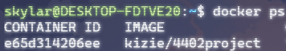
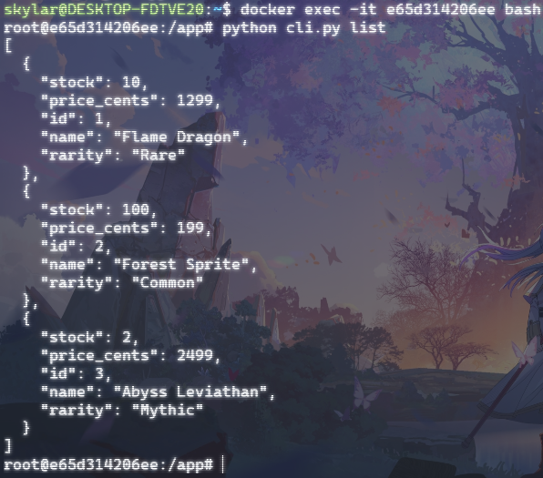

Repository for CSC 4402 Fall 2025
=
Project using some database. IN PROGRESS

Made by myself, [Brock](), and [Ryan]()

[some database link]()

Setup with Docker
=
**First**: download the docker image.
>`docker pull kizie/4402project`

**Second**: to start the container use the following:
>`docker run -d --name app -p 8000:8000 kizie/4402project`

**Third**: use the following command to ensure the container is running. Take note of the `CONTAINER ID` for the next step:
>`docker ps`

**Fourth**: to gain access inside the container, use the command:
>`docker exec -it <container_id> bash`

**Fifth**: from here you can access the cli.py file using:
>`python cli.py <argument>`

For example, use
>`python cli.py list`

to list all of the cards available.

List of all commands:
>`python cli.py list`

>`python cli.py get <id>`

>`python cli.py delete <id>`

>`python cli.py create --name <int: name> --rarity <str: rarity> --price-cents <int: price> --stock <int: stock>`

Rarieties are {Common, Uncommon, Rare, Mythic}

To exit the command line, use:
>`exit`

To stop the container, use:
>`docker stop <container_id>`
